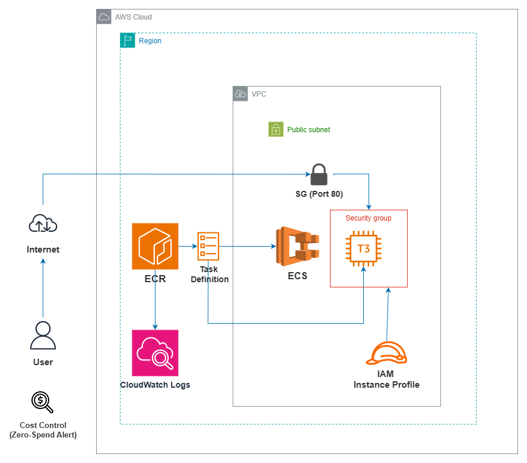
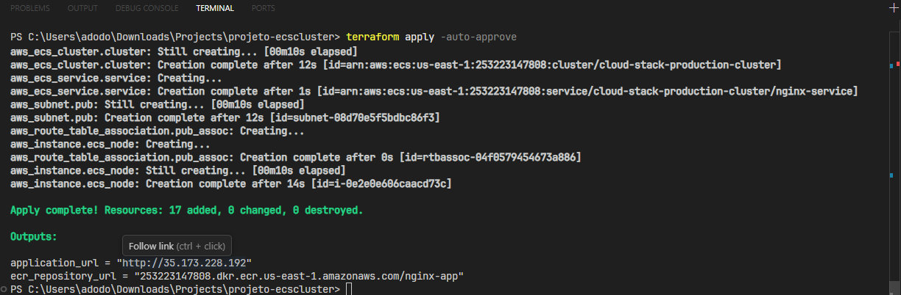
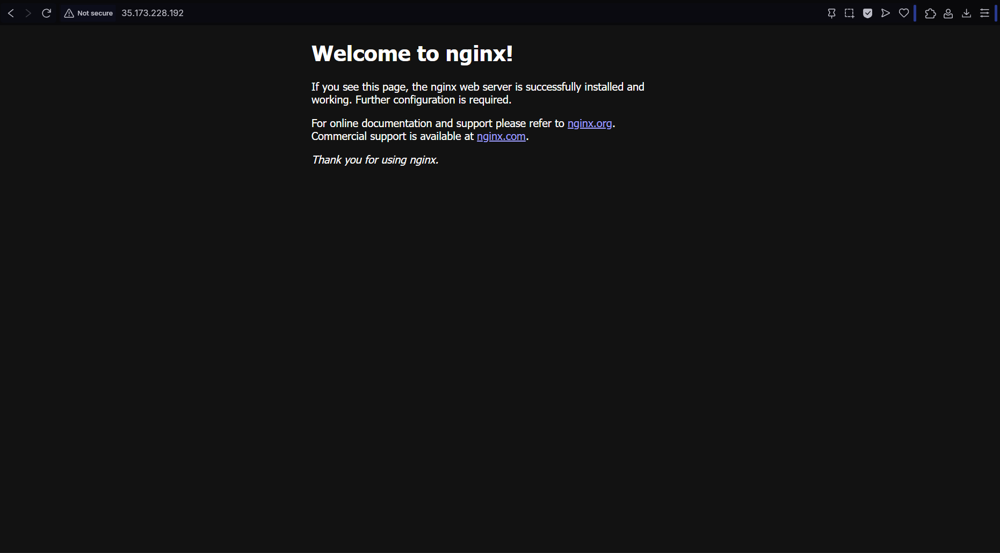

# AWS ECS Cluster Orchestration with Terraform 🚀

This repository contains the Infrastructure as Code (IaC) to deploy a scalable Nginx web server using **Amazon ECS (Elastic Container Service)** with the **EC2 Launch Type**.

The entire infrastructure is automated via **Terraform**, ensuring consistency, security, and cost-efficiency.

## 🏗️ Architecture

The following diagram illustrates the cloud architecture provisioned in this project:



### Key Components:
* **Networking:** Custom VPC with a Public Subnet, Internet Gateway, and optimized Route Tables.
* **Orchestration:** Amazon ECS Service managing Nginx containers.
* **Compute:** EC2 T3.micro instance (ECS-Optimized AMI) serving as the container host.
* **Logging:** CloudWatch Log Groups for real-time container monitoring.
* **Security:** Fine-grained IAM Roles and Security Groups for controlled access.

---

## 📂 Project Structure
The infrastructure is modularized for better maintainability:

* **main.tf:** Core infrastructure including VPC, ECS Cluster, and Networking.

* **iam.tf:** Dedicated security file containing IAM Roles, Instance Profiles, and Policies.

* **output.tf:** Exports key information like the Public IP and ECR URL.

* **variables.tf:** Parameterized configurations for the environment.

---

## 📋 Prerequisites

Before running this project, ensure you have:
* **AWS CLI** configured with administrative access.
* **Terraform** (v1.0+) installed.

---

## 🚀 How to Run

1.  **Initialize Terraform:** ```bash
    terraform init
    ```
2.  **Review the Plan:** ```bash
    terraform plan
    ```
3.  **Deploy the Infrastructure:** ```bash
    terraform apply -auto-approve
    ```
4.  **Access the Application:** After the deployment, copy the `application_url` from the terminal output and paste it into your browser.

---

## 📸 Visual Evidence

### 1. Automated Provisioning
Terraform successfully planning and applying the infrastructure with clear output of the Public IP and ECR URL.


### 2. AWS Management Console
Verification of the ECS Cluster status and the EC2 instance health within the AWS environment.


### 3. Final Result
The Nginx welcome page accessed via the EC2 Public IP, confirming the end-to-end flow.


---


## 🛠️ Tech Stack
* **Cloud:** AWS (ECS, EC2, ECR, VPC, IAM, CloudWatch)
* **IaC:** Terraform
* **Container:** Docker / Nginx
* **Governance:** AWS Budgets (Zero-Spend Alert configured)

---

## 💰 Cost Management
As a cloud-native best practice, a **Zero-Spend Budget** was implemented to monitor costs in real-time and ensure the project stays within the **AWS Free Tier** limits.

---

## 🧹 Cleanup
To avoid unnecessary charges, destroy all resources when finished:
```bash
terraform destroy -auto-approve